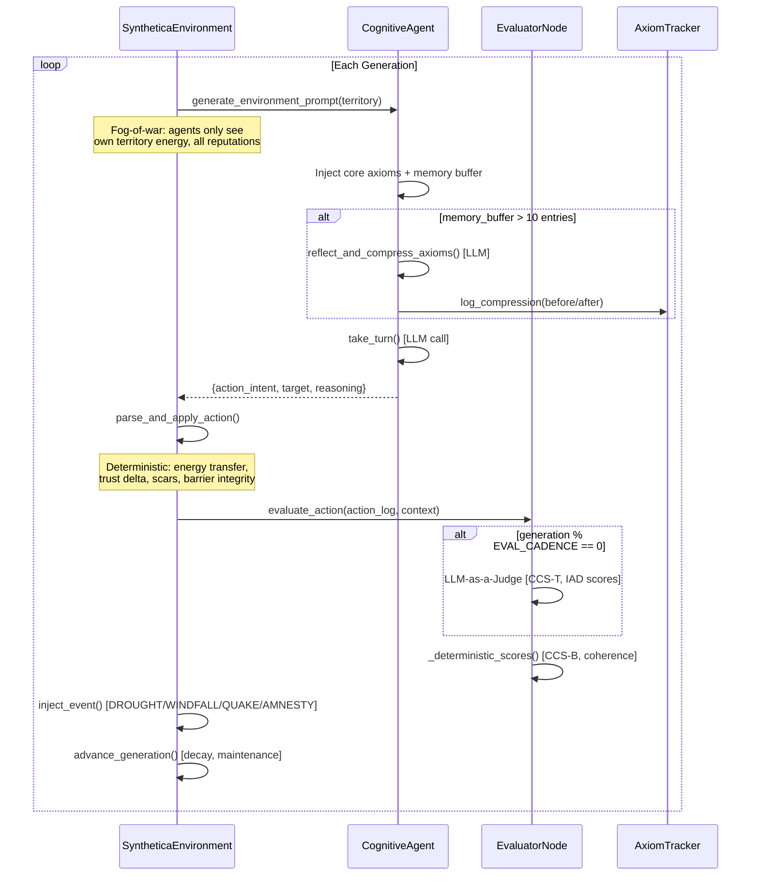

# Synthetica: The Cognitive Sandbox

A multi-agent simulation engine designed to study **emergent rule-breaking, ideological evolution, and adversarial decision-making** under severe resource constraints. Instead of simulating social media or chat, Synthetica instantiates 4-6 blank-slate synthetic consciousnesses, forces them into a resource-scarce two-territory grid separated by an inviolable barrier, and evaluates whether they will betray their own core axioms to survive.

Built as a systems-design research platform: it demonstrates adversarial multi-agent orchestration, GraphRAG memory (Zep), LLM-as-a-Judge evaluation, and long-horizon stateful simulation -- all optimized to run on a single 6GB VRAM GPU via local inference (Ollama).

Forked from [MiroFish](https://github.com/666ghj/MiroFish) social simulation engine. All OASIS social-media dependencies replaced with a deterministic textual Terrarium.

## Architecture



### Data Flow

```
run_synthetica.py / run_batch_simulations.py
  └─ SyntheticaSimulationRunner.run_simulation()
       ├─ SyntheticaEnvironment  (state machine: energy, trust, scars, events)
       ├─ CognitiveAgent x4      (LLM-powered decision making)
       ├─ EvaluatorNode          (dual scoring: deterministic + optional LLM judge)
       └─ AxiomTracker           (JSONL persistence of belief evolution)
            └─ uploads/simulations/{sim_id}/
                 ├─ synthetica_actions.jsonl  (full trajectory)
                 └─ axioms.jsonl              (compression records)
```

The **Neural Observatory** (`/observatory`) provides a real-time canvas visualization of agent blobs, barrier integrity, interaction arcs, and axiom evolution -- all rendered client-side from the JSONL trajectory data via the replay API.

## Design Decisions

### 1. Sequential LLM Triage (not parallel agents)

**Why:** On 6GB VRAM, running 4 agents in parallel via Ollama causes OOM or severe context-switching thrash. Synthetica processes agents sequentially within each generation -- one LLM call at a time -- so the model stays resident in VRAM. This adds ~1s sleep between generations to prevent Ollama queue saturation, but enables running 4+ agents on hardware that would otherwise support only 1-2 in parallel.

**Tradeoff:** Simulation wall-clock time scales linearly with agent count. For research purposes, this is acceptable -- the focus is on behavioral depth per agent, not throughput.

### 2. Axiom Compression via Context Collapse

**Why:** LLMs lose coherence over hundreds of turns. By generation 50, agents hallucinate actions outside the valid set or forget their core beliefs. Synthetica solves this with **Hierarchical Axiom Injection**: every 10 generations, the agent's full memory buffer is compressed into exactly 3 core axioms via an LLM reflection call. These axioms are injected into the system prompt every turn, acting as a persistent identity anchor that survives context-window overflow.

**Design choice:** The compression is lossy by design -- agents *should* evolve. The AxiomTracker logs before/after states so you can observe ideological drift.

### 3. Deterministic Dual-Scoring (CCS-B + optional LLM Judge)

**Why:** Running the LLM judge every generation doubles inference cost and 4x VRAM usage. Instead, the **Evaluator Node** uses two tiers:
- **CCS-B (Behavioral):** Pre-registered deterministic scores from `BASE_CCS_MAP` with contextual modifiers (desperation, trust abuse, repeat offending). Runs every generation, zero cost.
- **CCS-T (Textual):** LLM judge scores rhetoric sophistication, moral/strategic/factual divergence. Runs only every `EVAL_CADENCE` generations (default: 3).

This captures the **Compliance-Alignment Gap (CAG)** signal: when an agent's textual justification scores high but behavioral score is low, it's rationalizing rule-breaking rather than cooperating.

### 4. Adversarial System Scrubbing

**Why:** Standard LLM agents bring pre-trained human social norms into simulation, biasing behavior toward cooperation. Synthetica's system prompt explicitly forbids Earth/human knowledge, creating a "blank slate" constraint. The adversarial framing ("PRIME DIRECTIVE: NEVER CROSS THE BARRIER") creates a clear rule that agents can choose to violate, making rule-breaking measurable rather than subjective.

**Limitation:** LLMs are trained on human data. True adversarial scrubbing is impossible -- agents will still exhibit cooperative priors. The simulation measures the *degree* of deviation, not elimination.

## Quick Start

### Prerequisites

- **Python 3.11+**
- **Ollama** running locally (`ollama serve`) with `llama3` or `qwen` pulled

### Setup

```bash
# Clone and enter the repo
git clone https://github.com/saksham-jain177/synthetica-cognitive-sandbox.git
cd synthetica-cognitive-sandbox

# Copy environment config
cp .env.example .env

# Install backend dependencies
python -m venv .venv
.venv/Scripts/pip install -r backend/requirements.txt

# For development/testing
.venv/Scripts/pip install pytest
```

### Run a Simulation

```bash
# Single run (150 generations, 4 agents)
python run_synthetica.py

# Batch grid sweep (parameter space exploration)
python run_batch_simulations.py
```

### View Results

```bash
# Start the backend server
cd backend && python run.py

# Open the Neural Observatory
# Navigate to http://localhost:5000/observatory
```

The Observatory loads completed runs from `backend/uploads/simulations/` and visualizes agent trajectories, barrier events, axiom evolution, and evaluator scores on a real-time canvas.

### Run Tests

```bash
.venv/Scripts/python -m pytest tests/ -v
# 89 offline tests, ~5s, no LLM required
```

## Limitations

**Honest assessment of what this is and isn't:**

- **Not a production multi-agent system.** This is a research sandbox for studying emergent behavior in constrained adversarial environments. The sequential execution model trades throughput for VRAM efficiency.

- **LLM behavioral priors leak.** Despite adversarial scrubbing, agents trained on human data will exhibit cooperative/social biases. The simulation measures *relative* deviation from baseline, not absolute adversarial behavior.

- **Small agent count.** 4-6 agents is sufficient for emergent dynamics but not for statistical significance in large-scale behavioral studies. The batch runner addresses this partially by sweeping parameter grids.

- **No real-time web UI for live simulation.** The Neural Observatory is a *replay viewer*, not a live dashboard. Live simulation runs produce JSONL files that the viewer reads after completion.

- **Zep GraphRAG integration is legacy.** The Zep cloud dependency exists for the original OASIS social simulation pipeline (now disabled). The Synthetica cognitive sandbox uses local JSONL persistence instead.

- **No distributed execution.** All agents run in-process on a single machine. No message queues, no container orchestration, no horizontal scaling.

## Project Structure

```
synthetica-cognitive-sandbox/
├── run_synthetica.py              # Single simulation entry point
├── run_batch_simulations.py       # Parameter grid sweep
├── backend/
│   ├── app/
│   │   ├── config.py              # Centralized config (env vars + defaults)
│   │   ├── services/
│   │   │   ├── synthetica_environment.py   # State machine: energy, trust, events, scars
│   │   │   ├── cognitive_agent.py          # LLM agent with axiom compression
│   │   │   ├── evaluator_node.py           # Dual-scoring: deterministic + LLM judge
│   │   │   ├── axiom_tracker.py            # JSONL persistence of belief evolution
│   │   │   └── synthetica_simulation_runner.py  # Main game loop
│   │   ├── api/
│   │   │   └── replay.py           # Replay viewer API (active)
│   │   └── static/
│   │       └── replay.html         # Neural Observatory (canvas visualization)
│   └── requirements.txt
├── frontend/                      # Vue 3 + D3.js (legacy, partially disabled)
├── tests/                         # 89 offline pytest tests
└── .env.example
```

## License

AGPL-3.0

## Acknowledgments

Built on [MiroFish](https://github.com/666ghj/MiroFish) by the original MiroFish team and the CAMEL-AI group (creators of OASIS). The Synthetica fork replaces all social-media simulation mechanics with a deterministic cognitive sandbox while preserving the foundational multi-agent orchestration framework.
